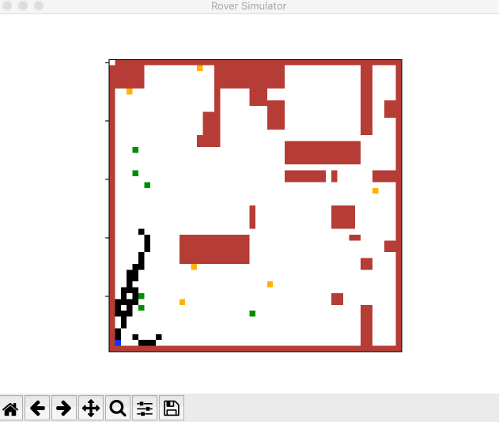

Rover Simulator
======
This project creates a multiagent `Mars Rover Simulator` for finding samples, leaving traces and avoiding obstacles in a given map.

Dependencies Installation
------
It was developed and tested with `python 3.7.3`.

The libraries needed are:
* `numpy`
* `matplotlib`

Running The Project
------
For running the project. In the root folder, it is executed the following command: `python3 run_simulation.py`

After that, a window similar to the next one is displayed, where all the interactions from the rovers are shown.

In the terminal, it is output the current position from each of the rover. If they caught the samples, the traces and if they came back to the mother ship.

Simbology From The Map
------
 MotherShip color, map value = `2`

 Rover color, map value = `3`

 Sample color, map value = `5`

 Obstacle color, map value = `1`

 Trace color, map value = `8` for _Two Traces_ or `7` for _One Trace_

 Empty space color, map value = `0`

Customizing Simulation
------

General Description from the Actual Behavior
------

